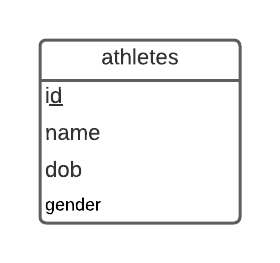
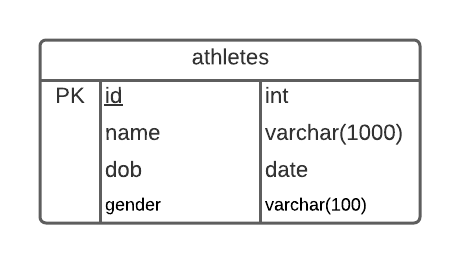

# leaderboard

## Sommaire

| Sommaire | Valeur |
| --- | --- |
| Cours | CSI 2532 |
| Date | Hiver 2021 |
| Professor | [Andrew Forward](aforward@uottawa.ca) |
| Equipe | Younes Anys (300145843) |

## Livrables

### Livrable 1 (5%) Hello-World

| Note | Description | 
| --- | --- |
| 2.0 | Configuration du repo GitHub |
| 2.5 | Modèle ER |
| 2.5 | Modèle relationnel / schéma SQL | 
| 1.0 | Exemples SQL pour insérer, mettre à jour, sélectionner et supprimer des données |
| 1.0 | README.md contient toutes les informations requises |
| 1.0 | Utilisation de git (messages de commit, tous les étudiants impliqués) |
| / 10 | |

## Modèle ER

Le diagramme ER a été créé avec Lucidchart.

## Modèle relationnel

Le modèle relationnel a également été créé avec Lucidchart

