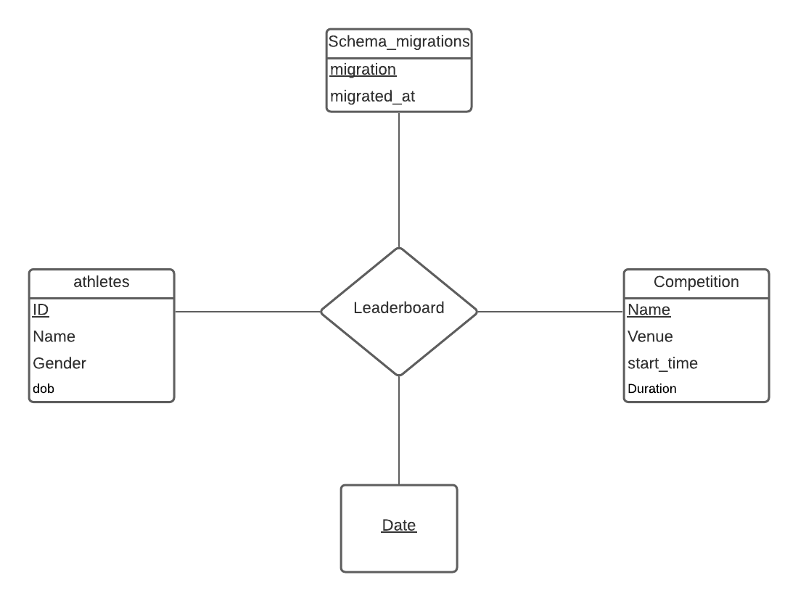

#  Leaderboard

## Sommaire

| Sommaire | Valeur |
| --- | --- |
| Cours | CSI 2532 |
| Session | Hiver 2021 |
| Professeur | Andrew Forward |
| Equipe | Younes Anys (300145843) |

## Livrables

### Livrable 3 (12%)  L'application

| Note | Description | 
| --- | --- |
| 2.0 | Modèle ER  |
| 2.0 | Modèle relationnel / schéma SQL |
| 2.0 | SQL "seed" / exemples / migrations | 
| 2.0 | Application |
| 1.0 | README.md contient toutes les informations requises |
| 1.0 | Utilisation de git (messages de commit, tous les étudiants impliqués) |
| / 10 | |

## Modèle ER


## Modèle relationnel / schéma SQL


## SQL "seed" / exemples / migrations

SVP voir le dossier database


### Livrable 2 (5%)  Application + DB

| Note | Description | 
| --- | --- |
| 3.0 | Modèle ER  |
| 3.0 | Modèle relationnel / schéma SQL |
| 1.0 | Application (READ-ONLY) | 
| 1.0 | SQL "seed" / exemples pour INSERT, UPDATE, SELECT, DELETE des données |
| 1.0 | README.md contient toutes les informations requises |
| 1.0 | Utilisation de git (messages de commit, tous les étudiants impliqués) |
| / 10 | |

Les modèles de bases de données évoluent. Ici on va gérer l'évolution de votre base de données en utilisant
les migrations.

## Modèle ER




## Modèle relationnel / schéma SQL

## Schéma SQL

```sql
CREATE TABLE athletes (
	ID int PRIMARY KEY,
	Name varchar(50),
	Gender varchar(6),
	dob date
);
CREATE TABLE Competition (
	Name varchar(50) PRIMARY KEY,
	Venue varchar(50),
	start_time date
);
CREATE TABLE register (
	athletes int,
	Competition varchar(50),
	start_time date,
	migration date,
	PRIMARY KEY (athletes, Competition, Date),
	foreign key (athletes) references athletes(athletes),
	foreign key (Competition) references competition(Name),
);

SELECT* 
FROM athletes;

DELETE
FROM athletes 
WHERE Name='Younes';
SELECT* 
FROM athletes;

UPDATE athletes 
SET Name = 'Alex' 
WHERE Name = 'Sami';
SELECT* 
FROM athletes;

INSERT INTO Competition VALUES ('Course', 'Summer', '2021/06/17');
INSERT INTO Competition VALUES ('soccer', 'Winter', '2021/01/01');
INSERT INTO Competition VALUES ('soccer', 'Winter', '2021/02/10');
SELECT* 
FROM Competition;

INSERT INTO register VALUES (7, '0000005', '003');
INSERT INTO register VALUES (5, '0000007', '007');
SELECT* 
FROM register;


DELETE
FROM Competition 
WHERE Name='soccer';
SELECT* 
FROM Competition;

DELETE
FROM register 
WHERE ID ='0000007';
SELECT* 
FROM register;

UPDATE Competition 
SET Venue = 'automne' 
WHERE Name = '007';
SELECT* 
FROM Competition;

UPDATE register 
WHERE ID = '0000005';
SELECT* 
FROM register;

```
"seed" SQL

exemples SQL

```sql
INSERT INTO athletes VALUES('Younes', '1999/02/10', 'M', '0000001');
INSERT INTO athletes VALUES('Mohamed', '1997/06/10', 'M', '0000005');
INSERT INTO athletes VALUES('Sami', '1999/07/05', 'M', '0000002');
INSERT INTO athletes VALUES('Sarah', '1998/05/10', 'F', '0000007');

SELECT* 
FROM athletes;

DELETE
FROM athletes
WHERE Name='Younes';
SELECT* 
FROM athletes;

UPDATE athletes 
SET Name = 'Alex' 
WHERE Name = 'Sami';
SELECT* 
FROM athletes;

INSERT INTO competitions VALUES ('Course', 'Summer', '2021/07/07', '001');
INSERT INTO competitions VALUES ('soccer', 'Winter', '2021/02/10', '007');
INSERT INTO competitions VALUES ('soccer', 'Winter', '2021/02/10', '003');
SELECT* 
FROM competitions;

INSERT INTO register VALUES (7, '0000005', '003');
INSERT INTO register VALUES (5, '0000007', '007');
SELECT* 
FROM register;


DELETE
FROM Competition 
WHERE Name='soccer';
SELECT* 
FROM Competition;

DELETE
FROM register 
WHERE ID ='0000007';
SELECT* 
FROM register;

UPDATE Competition 
SET Venue = 'automne' 
WHERE Name = 'soccer';
SELECT* 
FROM Competition;

UPDATE register 
WHERE ID = '0000005';
SELECT* 
FROM register;

```

### Livrable 1 (5%) Hello-World

| Note | Description | 
| --- | --- |
| 2.0 | Configuration du repo GitHub |
| 2.5 | Modèle ER |
| 2.5 | Modèle relationnel / schéma SQL | 
| 1.0 | Exemples SQL pour insérer, mettre à jour, sélectionner et supprimer des données |
| 1.0 | README.md contient toutes les informations requises |
| 1.0 | Utilisation de git (messages de commit, tous les étudiants impliqués) |
| / 10 | |

La base de données du leaderboard doit uniquement modéliser les athlètes et inclure des détails tels que leur
nom, leur date de naissance et leur sexe identifié.

## Modèle ER

Le diagramme ER a été créé avec [Lucidchart](https://www.lucidchart.com/pages/fr)


(Veuillez cliquer sur l'image pour accéder a son fichier source)
## Modèle relationnel

Le modèle relationnel a également été créé avec Lucidchart


(Veuillez cliquer sur l'image pour accéder a son fichier source)

## Schéma SQL

Cela a été executé et testé avec [Online SQL Interpreter](https://www.db-book.com/db7/university-lab-dir/sqljs.html)
(juste copier-coller les lignes de code ci-dessous pour l'executer)

```sql
CREATE TABLE athletes (
  id int,
  name varchar(50),
  dob date,
  gender varchar(6),
  PRIMARY KEY (id)
);
```

## Exemples de requêtes SQL

#### INSERT

Après avoir exécuté le schéma, vous pouvez tester les requêtes
dans [Interpréteur SQL en ligne](https://www.db-book.com/db7/university-lab-dir/sqljs.html)
"Refresh" le navigateur pour recommencer.

```sql
INSERT INTO athletes (id, name, dob, gender)
VALUES
(1, 'Younes', '2001-12-01', 'm' ),
(2, 'Alex', '1999-06-11', 'm'),
(3, 'Emma', '2000-09-24', 'f'),
(4, 'Marie', '1995-06-09', 'f');
```


Pour visualiser les résultats : Apres avoir coller ces lignes de code, supprimer tout puis mettre : 

```sql
SELECT * 
FROM athletes;
```
#### UPDATE

Mettez à jour tous les «m» à «Male».

```sql
UPDATE athletes
SET gender = 'Male'
WHERE gender = 'm';
```


Et maintenant, on selectionne tous les athlètes de genre masculin «Male»
#### SELECT

```sql
SELECT *
FROM athletes
WHERE gender = 'Male';
```


#### DELETE

Supprimons tous les athlètes.

```sql
DELETE FROM athletes;
```


